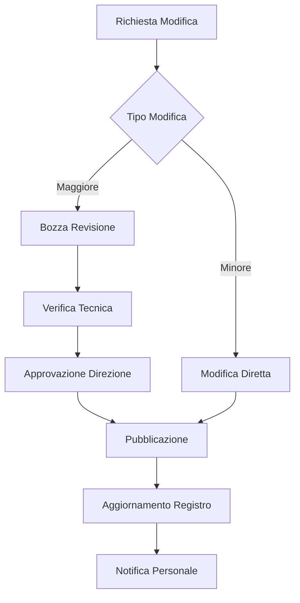

# Registro delle Revisioni

| Codice | Versione | Data Emissione | Data Revisione | Approvato da |
|--------|----------|----------------|----------------|--------------|
| REG-DOC-002 | 1.0 | 25/01/2026 | - | Direzione Generale |

---

!!! warning "TRACCIABILITÀ COMPLETA"
    Questo registro documenta **ogni modifica** apportata ai documenti del sistema. Costituisce prova dell'evoluzione documentale e della non alterabilità retroattiva dei contenuti.

---

## Revisioni 2026

### Gennaio 2026

| Data | Codice Doc. | Versione | Tipo Modifica | Descrizione | Autore | Approvato |
|------|-------------|----------|---------------|-------------|--------|-----------|
| 25/01/2026 | TUTTI | 1.0 | Emissione Iniziale | Prima emissione sistema documentale | Direzione | Sì |

---

## Storico Completo

!!! info "Integrazione con Git"
    Lo storico completo delle modifiche è mantenuto nel repository Git. Ogni commit include:

    - **Hash univoco** identificativo della modifica
    - **Timestamp** certificato
    - **Autore** della modifica
    - **Descrizione** dettagliata
    - **File modificati** con diff esatto

### Come Verificare lo Storico

Per verificare lo storico completo delle modifiche:

```bash
# Visualizza tutti i commit
git log --oneline

# Visualizza modifiche di un file specifico
git log -p docs/[percorso-file].md

# Visualizza chi ha modificato cosa
git blame docs/[percorso-file].md
```

---

## Tipi di Modifica

| Tipo | Descrizione | Richiede Approvazione |
|------|-------------|----------------------|
| Emissione Iniziale | Prima pubblicazione del documento | Sì |
| Revisione Maggiore | Modifiche sostanziali al contenuto | Sì |
| Revisione Minore | Correzioni formali, refusi | No |
| Aggiornamento Riferimenti | Aggiornamento link o riferimenti | No |
| Obsolescenza | Documento reso obsoleto | Sì |

---

## Procedura di Revisione



### Passi della Procedura

1. **Richiesta di Modifica**
   - Chiunque può richiedere una modifica
   - La richiesta deve essere motivata

2. **Valutazione**
   - Il Responsabile Qualità valuta il tipo di modifica
   - Determina se è maggiore o minore

3. **Redazione**
   - Preparazione della nuova versione
   - Evidenziazione delle modifiche

4. **Verifica**
   - Controllo tecnico del contenuto
   - Verifica coerenza con altri documenti

5. **Approvazione**
   - Solo per modifiche maggiori
   - Firma della Direzione

6. **Pubblicazione**
   - Aggiornamento del manuale online
   - Commit nel repository

7. **Notifica**
   - Comunicazione al personale
   - Richiesta nuova presa visione se necessario

---

## Conservazione Versioni Obsolete

Le versioni obsolete dei documenti sono conservate per **10 anni** nel repository Git.

### Recupero Versione Precedente

```bash
# Visualizza versioni precedenti di un file
git log --oneline docs/[percorso-file].md

# Visualizza contenuto di una versione specifica
git show [commit-hash]:docs/[percorso-file].md
```

---

## Firma Digitale delle Revisioni

Ogni commit nel repository è firmato e include:

| Elemento | Descrizione |
|----------|-------------|
| Hash SHA-1 | Identificativo univoco del commit |
| Autore | Email dell'autore della modifica |
| Data | Timestamp UTC della modifica |
| Messaggio | Descrizione della modifica |

---

**Responsabile Registro:** Responsabile Qualità

**Data ultimo aggiornamento:** 25 Gennaio 2026
