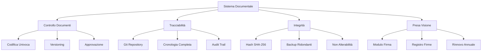
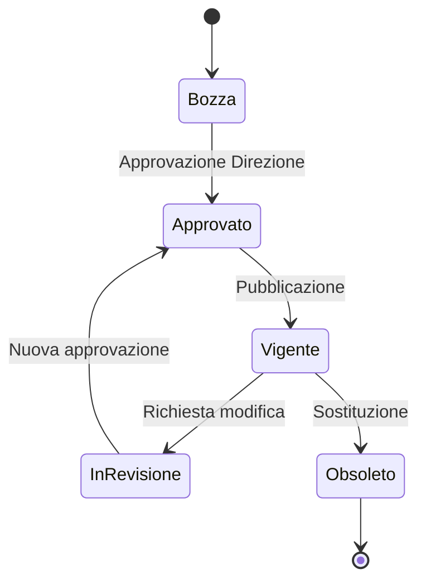
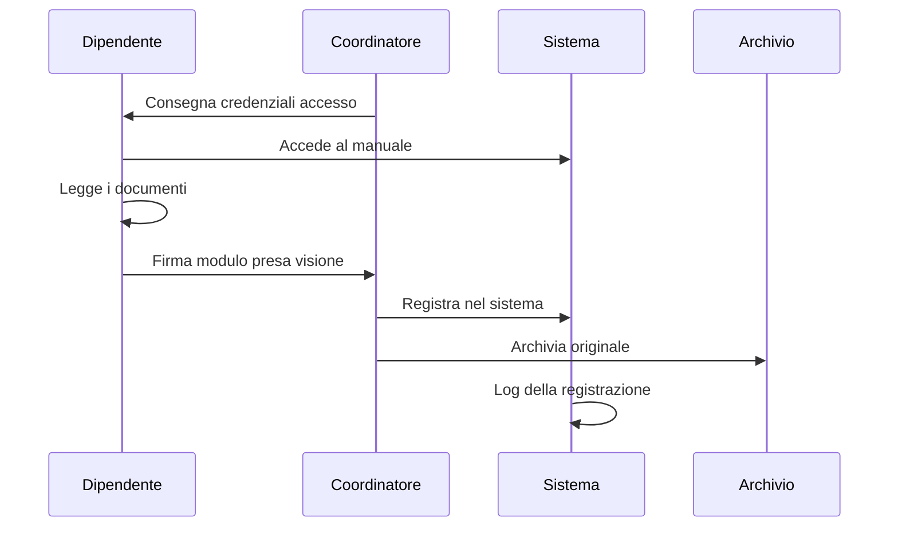

# Riepilogo Sistema di Validità Legale

| Codice | Versione | Data Emissione | Data Revisione | Approvato da |
|--------|----------|----------------|----------------|--------------|
| DOC-SIS-001 | 1.0 | 25/01/2026 | - | Direzione Generale |

---

!!! success "SISTEMA CONFORME ISO 9001:2015"
    Il Sistema Documentale di {{ clinic.legal_name }} è progettato per garantire la **validità legale** di tutti i documenti e la **non contestabilità** delle procedure aziendali da parte del personale.

---

## Panoramica del Sistema



---

## Le 4 Garanzie Fondamentali

### 1. Non Alterabilità

| Caratteristica | Descrizione |
|----------------|-------------|
| **Tecnologia** | Repository Git con cronologia immutabile |
| **Protezione** | Ogni modifica genera un hash crittografico unico |
| **Verifica** | Impossibile modificare senza lasciare traccia |
| **Prova** | Perizia tecnica può certificare l'integrità |

!!! danger "Cosa significa per il dipendente"
    Un dipendente **non può sostenere** che il documento sia stato alterato dopo la sua presa visione. Il sistema Git registra immutabilmente ogni modifica con data, ora e autore.

---

### 2. Non Ripudiabilità

| Caratteristica | Descrizione |
|----------------|-------------|
| **Strumento** | Modulo di Presa Visione firmato |
| **Conservazione** | Originale cartaceo + copia digitale |
| **Durata** | Rapporto di lavoro + 10 anni |
| **Valore** | Prova documentale opponibile |

!!! danger "Cosa significa per il dipendente"
    Un dipendente **non può negare** di aver preso visione delle procedure. La firma sul modulo costituisce prova legale della conoscenza.

---

### 3. Verificabilità

| Caratteristica | Descrizione |
|----------------|-------------|
| **Metodo** | Hash SHA-256 per ogni documento |
| **Accesso** | Verificabile in qualsiasi momento |
| **Procedura** | Confronto hash attuale vs. riferimento |
| **Risultato** | Certezza matematica dell'integrità |

!!! danger "Cosa significa per il dipendente"
    In caso di contestazione, è possibile **dimostrare con certezza matematica** che il documento non è stato modificato.

---

### 4. Data Certa

| Caratteristica | Descrizione |
|----------------|-------------|
| **Fonte** | Timestamp certificati Git |
| **Precisione** | Fino al secondo |
| **Immutabilità** | Non modificabile retroattivamente |
| **Validità** | Conforme D.Lgs. 82/2005 |

!!! danger "Cosa significa per il dipendente"
    È possibile **provare esattamente** quale versione del documento era in vigore in qualsiasi data passata.

---

## Protezione dalle Contestazioni

### Scenari Comuni e Risposte

| Il dipendente dice... | Risposta del sistema |
|----------------------|----------------------|
| "Non sapevo di questa procedura" | Modulo di presa visione firmato con elenco documenti |
| "Il documento è stato modificato dopo" | Hash SHA-256 + cronologia Git immutabile |
| "Non ho mai visto questo documento" | Registro prese visione con data e firma |
| "La procedura diceva altro" | Git permette di recuperare la versione esatta |
| "Non mi è stata data formazione" | Presa visione include attestazione di comprensione |
| "Il sistema può essere manomesso" | Backup ridondanti + perizia tecnica certificabile |

---

## Struttura Documentale

### Gerarchia dei Documenti

```
Sistema Documentale
├── Politiche (POL)
│   └── Regole generali del sistema
├── Protocolli (PRO)
│   └── Standard da rispettare
├── Procedure (PRC)
│   └── Passaggi operativi
├── Checklist (CHK)
│   └── Verifiche puntuali
├── Moduli (MOD)
│   └── Documenti da compilare
└── Istruzioni (IST)
    └── Guide operative
```

### Codifica Documenti

Ogni documento ha un codice univoco:

```
[TIPO]-[AREA]-[NUMERO]

Esempi:
PRO-CLI-001 = Protocollo Clinica n. 001
PRC-COR-015 = Procedura Corporate n. 015
MOD-GEN-003 = Modulo Generali n. 003
```

---

## Flusso di Gestione

### Ciclo di Vita Documento



### Processo di Presa Visione



---

## Riferimenti Normativi

### Normativa Italiana

| Riferimento | Applicazione |
|-------------|--------------|
| **Art. 2712 C.C.** | Efficacia probatoria delle riproduzioni meccaniche |
| **Art. 2104 C.C.** | Diligenza del prestatore di lavoro |
| **Art. 2105 C.C.** | Obbligo di fedeltà |
| **Art. 2106 C.C.** | Sanzioni disciplinari |
| **D.Lgs. 82/2005** | Codice dell'Amministrazione Digitale |
| **L. 300/1970** | Statuto dei Lavoratori (art. 7) |

### Normativa Europea

| Riferimento | Applicazione |
|-------------|--------------|
| **Reg. UE 910/2014** | Regolamento eIDAS - firme elettroniche |
| **Reg. UE 2016/679** | GDPR - protezione dati |

### Standard Internazionali

| Riferimento | Applicazione |
|-------------|--------------|
| **ISO 9001:2015** | Par. 7.5 - Controllo documenti |
| **ISO 27001** | Sicurezza delle informazioni |

---

## Responsabilità

### Matrice RACI

| Attività | Direzione | Resp. Qualità | Coordinatore | Dipendente |
|----------|:---------:|:-------------:|:------------:|:----------:|
| Approvazione documenti | **R** | C | I | I |
| Gestione sistema | A | **R** | C | I |
| Raccolta prese visione | A | C | **R** | I |
| Consultazione manuale | I | I | C | **R** |
| Rispetto procedure | A | C | C | **R** |

**R** = Responsabile | **A** = Approvatore | **C** = Consultato | **I** = Informato

---

## Statistiche Sistema

### Documenti Gestiti

| Categoria | Quantità |
|-----------|:--------:|
| Protocolli | 36 |
| Procedure | 29 |
| Checklist | 5 |
| Moduli | 15 |
| Documenti Sistema | 6 |
| **TOTALE** | **91** |

### Copertura

| Area | Documenti | Stato |
|------|:---------:|:-----:|
| Generali | 5 | Completo |
| Corporate | 26 | Completo |
| Clinica | 54 | Completo |
| Sede | 0 | Da personalizzare |
| Sistema | 6 | Completo |

---

## Vantaggi del Sistema

### Per l'Azienda

- **Tutela legale** in caso di contestazioni
- **Standardizzazione** delle procedure
- **Tracciabilità** completa delle attività
- **Conformità** normativa garantita
- **Audit** semplificati

### Per il Personale

- **Chiarezza** su cosa fare e come
- **Formazione** documentata
- **Riferimento** sempre disponibile
- **Aggiornamenti** tracciati
- **Tutela** in caso di dubbi

---

## Contatti

| Ruolo | Responsabilità | Contatto |
|-------|----------------|----------|
| Direzione Generale | Approvazione finale | {{ clinic.email_direzione }} |
| Responsabile Qualità | Gestione sistema | qualita@smiledoc.it |
| Coordinatore Sede | Prese visione | coordinatore@smiledoc.it |

---

!!! info "Aggiornamento"
    Questa pagina viene aggiornata ad ogni modifica del sistema documentale.

    **Ultimo aggiornamento:** 25 Gennaio 2026

    **Prossima revisione:** 25 Gennaio 2027
