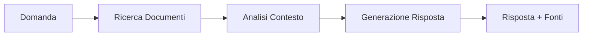

# Assistente AI HR

L'assistente AI di Smiledoc è un sistema di supporto basato su intelligenza artificiale che aiuta i dipendenti a trovare rapidamente informazioni su procedure, normative e documentazione aziendale.

## Come Funziona

L'assistente utilizza la tecnologia **RAG (Retrieval Augmented Generation)**:

1. **Ricerca** - Quando fai una domanda, il sistema cerca nei documenti aziendali
2. **Contestualizzazione** - Le informazioni trovate vengono analizzate
3. **Risposta** - L'AI genera una risposta precisa basata sui documenti ufficiali

## Utilizzo

### Accesso al Chat

1. Clicca sull'icona chat in basso a destra
2. Scrivi la tua domanda in linguaggio naturale
3. L'assistente risponderà citando le fonti

### Esempi di Domande

| Categoria | Esempio |
|-----------|---------|
| Sicurezza | "Quali sono i DPI obbligatori in sala operativa?" |
| Privacy | "Come gestisco una richiesta di accesso ai dati?" |
| Procedure | "Qual è la procedura per la sterilizzazione?" |
| Formazione | "Quali corsi devo completare entro fine anno?" |
| Emergenze | "Cosa fare in caso di reazione allergica?" |

## Escalation

Se l'assistente non riesce a rispondere alla tua domanda:

1. Clicca su **"Parla con HR"**
2. La tua domanda verrà inoltrata al team
3. Riceverai una notifica quando arriva la risposta

!!! warning "Quando Usare l'Escalation"
    Usa l'escalation per:

    - Domande su casi personali (ferie, permessi)
    - Situazioni non documentate
    - Problemi tecnici con il sistema

## Feedback

Dopo ogni risposta puoi dare un feedback:

- 👍 **Utile** - La risposta ha risolto il tuo dubbio
- 👎 **Non utile** - Hai bisogno di più informazioni

Il feedback aiuta a migliorare il sistema.

## Storico Conversazioni

Le tue conversazioni sono salvate e puoi:

- Consultare lo storico dalla sezione HR
- Riprendere una conversazione precedente
- Esportare le risposte ricevute

## Limiti

L'assistente **non può**:

- Prendere decisioni per conto tuo
- Modificare documenti o dati
- Accedere a informazioni di altri dipendenti
- Rispondere su argomenti non lavorativi

## Privacy

- Le conversazioni sono riservate
- Solo il team HR può vedere le escalation
- I dati sono crittografati
- Retention: 90 giorni

---

!!! tip "Suggerimento"
    Per risposte più precise, formula domande specifiche. Invece di "Come funziona la sicurezza?", chiedi "Quali sono le procedure da seguire in caso di incendio?".
